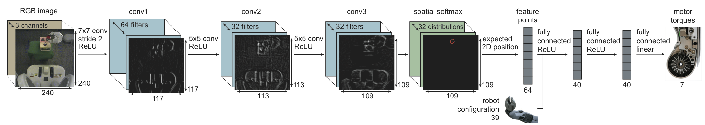

## End-to-End Learning of Deep Visuomotor Policies

Kai Arulkumaran

24 April 2015

------------------

<iframe data-autoplay width="960" height="540" src="https://www.youtube.com/embed/Q4bMcUk6pcw" frameborder="0" allowfullscreen></iframe>

------------------

### Summary

- Policy search to learn control for robot tasks
- Deep learning for learning features from low-level observations (joint angles + camera images) all the way to joint torques (no "computer vision system" or PD controller)
- Relatively few samples/iterations

------------------

### Reinforcement Learning

- Agent in an environment learns through trial and error (no labels, just delayed signal)
- Set of states $X$ and set of actions $U$
- Policy $\pi$ determines action $\mathbf{u}_t$ to perform given the state $\mathbf{x}_t$
- Action transitions $\mathbf{x}_t$ to $\mathbf{x}_{t+1}$ with scalar reward $r_{t+1}$
- Maximise expected return (sum of rewards) $R$ given policy: $\mathbb{E}[R|\pi]$

------------------

### Observability

- Markov Chain (MC) is a random process with state transitions (alternatively a random walk on a graph), with the Markov property: $$\mathbb{P}[\mathbf{x}_{t+1}|\mathbf{x}_t] = \mathbb{P}[\mathbf{x}_{t+1}|\mathbf{x}_t,...,\mathbf{x}_1]$$
- Markov Decision Process (MDP) extends MC with actions and rewards
- **Full observability**: observations ($O$) give entire state of environment = MDP
- **Partial observability**: observations give incomplete state of environment = Partially Observable MDP (POMDP)

------------------

### Policy Search

- Parametrise the policy: $\pi_\theta(\mathbf{u}_t|\mathbf{o}_t)$
- Optimise performance of policy with objective function $\ell(\mathbf{x}_t, \mathbf{u}_t)$ e.g. distances between points, low torque
- Guided Policy Search
    1. Trajectory optimisation phase (fully observed)
    2. Supervised learning phase (partially observed)
- Phase 1: Unknown dynamics but do know $\mathbf{x}_t$ e.g. holding bottle in other hand - controlled environment training
- Phase 2: Trained on $\mathbf{o}_t$ to handle partial observability

------------------

### Partially Observed Guided Policy Search

- Trajectory: $\tau = \{\mathbf{x}_1, \mathbf{u}_1, ..., \mathbf{x}_T, \mathbf{u}_T\}$
- $p(\tau)$ = mixture of $N$ Gaussians $p_i(\tau)$
- Assumes noise small/Gaussian
- Produces mean trajectory with linear feedback
- Succeed from several initial states $\mathbf{x}_1^i$, final policy generalises from same distribution (labels)
- Outer loop samples trajectories from a policy
- Inner loop iteratively enforces agreement between $\pi_\theta(\mathbf{u}_t|\mathbf{o}_t)$ and $p_i(\tau)$

------------------

### Algorithm

- Policy search minimises expected cost: $$\min_{p, \pi_\theta}\mathbb{E}_p[\ell(\tau)] \text{ s.t. } p(\mathbf{u}_t|\mathbf{x}_t) = \pi_\theta(\mathbf{u}_t|\mathbf{x}_t) \ \forall \mathbf{x}_t, \mathbf{u}_t, t$$ 
- Recover $\pi_\theta(\mathbf{u}_t|\mathbf{x}_t) = \int\pi_\theta(\mathbf{u}_t|\mathbf{o}_t)p(\mathbf{o}_t|\mathbf{x}_t)d\mathbf{o}_t$, but instead evaluate integral with real samples
- Solve by dual descent method; alternate:
    1. Minimise Lagrangian w.r.t. primal variables
    2. Increment Lagrangian multipliers by their subgradient
- Part 1: minimising w.r.t. $p(\tau)$ = trajectory optimisation, minimising w.r.t. $\theta$ = supervised learning

------------------

### Bregman Alternating Direction Method of Multipliers (BADMM)

- Replace constraint: $p(\mathbf{u}_t|\mathbf{x}_t)p(\mathbf{x}_t) = \pi_\theta(\mathbf{u}_t|\mathbf{x}_t)p(\mathbf{x}_t)$
- $$\theta \leftarrow \arg\min_\theta \sum_{t=1}^T \mathbb{E}_{p(\mathbf{x}_t)\pi_\theta(\mathbf{u}_t|\mathbf{x}_t)}[\lambda_{\mathbf{x}_t,\mathbf{u}_t}] + v_t\phi_t^\theta(\theta,p)$$
- $$p \leftarrow \arg\min_p \sum_{t=1}^T \mathbb{E}_{p(\mathbf{x}_t,\mathbf{u}_t)}[\ell(\mathbf{x}_t,\mathbf{u}_t) - \lambda_{\mathbf{x}_t,\mathbf{u}_t}] + v_t\phi_t^p(p,\theta)$$
- $$\lambda_{\mathbf{x}_t,\mathbf{u}_t} \leftarrow \alpha v_t(\pi_\theta(\mathbf{u}_t|\mathbf{x}_t)p(\mathbf{x}_t) - p(\mathbf{u}_t|\mathbf{x}_t)p(\mathbf{x}_t))$$
- $\phi_t^\theta(\theta,p) \text{ and } \phi_t^p(p,\theta)$ are KL-divergence terms, $\lambda_{\mathbf{x}_t,\mathbf{u}_t}$ is Lagrangian multiplier, and $\alpha$ is step size

------------------

### Tractability

- Infinite set of constraints
- Replace with first moment of distributions, gives constraint on expected action: $$\mathbb{E}_{p(\mathbf{u}_t|\mathbf{x}_t)p(\mathbf{x}_t)}[\mathbf{u}_t] = \mathbb{E}_{\pi_\theta(\mathbf{u}_t|\mathbf{x}_t)p(\mathbf{x}_t)}[\mathbf{u}_t]$$
- Assumes (dynamics) noise small
- $$\theta \leftarrow \arg\min_\theta \sum_{t=1}^T \mathbb{E}_{p(\mathbf{x}_t)\pi_\theta(\mathbf{u}_t|\mathbf{x}_t)}[\mathbf{u}_t^T\lambda_{\mu t}] + v_t\phi_t^\theta(\theta,p)$$
- $$p \leftarrow \arg\min_p \sum_{t=1}^T \mathbb{E}_{p(\mathbf{x}_t,\mathbf{u}_t)}[\ell(\mathbf{x}_t,\mathbf{u}_t) - \mathbf{u}_t^T\lambda_{\mu t}] + v_t\phi_t^p(p,\theta)$$
- $$\lambda_{\mathbf{x}_t,\mathbf{u}_t} \leftarrow \alpha v_t(\mathbb{E}_{p(\mathbf{u}_t|\mathbf{x}_t)p(\mathbf{x}_t)}[\mathbf{u}_t] - \mathbb{E}_{\pi_\theta(\mathbf{u}_t|\mathbf{x}_t)p(\mathbf{x}_t)}[\mathbf{u}_t])$$

------------------

### Trajectory Optimisation

- Lagrangian factorises over mixture of Gaussians $p(\tau)$
- Dynamics $p(\mathbf{x}_{t+1}|\mathbf{x}_t,\mathbf{u}_t)$ and controller $p(\mathbf{u}_t|\mathbf{x}_t)$ are linear Gaussian
- Unknown dynamics means fitting $p(\mathbf{x}_{t+1}|\mathbf{x}_t,\mathbf{u}_t)$ to sample trajectories
- Samples gathered from running previous controller $\hat{p}(\mathbf{u}_t|\mathbf{x}_t)$
- Allow samples from trajectories $p_i(\tau)$ with similar starting states

------------------

### Supervised Learning

- Minimise KL-divergence between policy and trajectory distribution (labels)
- Minimise Lagrange multiplier of expected action $\lambda_{\mu t}$
- $$\frac{1}{2N}\sum_{n=1}^N\sum_{t=1}^T \mathbb{E}_{p_i(\mathbf{x}_t,\mathbf{o}_t)}[\mathbf{tr}[\mathbf{C}_{t_i}^{-1}\Sigma^\pi(\mathbf{o}_t)]-\log|\Sigma^\pi(\mathbf{o}_t)| + \\
(\mu^\pi(\mathbf{o}_t) - \mu_{t_i}^p(\mathbf{x}_t))\mathbf{C}_{t_i}^{-1}(\mu^\pi(\mathbf{o}_t) - \mu_{t_i}^p(\mathbf{x}_t)) + 2\lambda_{\mu t}^T\mu^\pi(\mathbf{o}_t)]$$
- Train with Stochastic Gradient Descent
- Include samples from previous iterations with importance sampling

------------------

### Architecture

- Inputs are monocular RGB images plus angles and velocities of joints and end-effector
- Convolutional Neural Network with Rectified Linear Units

- No pooling which discards location information
- Spatial softmax $e^{a_{cij}}/\sum_{i'j'}e^{a_{ci'j'}}$ produces distribution over locations of *task-specific* visual features
- Concatenate with robot configuration through Fully Connected ReLU layers to linear motor torque layer

------------------

### Training

- Trajectory optimisation is fully observed, supervised learning is partial

------------------

### Initialisation

- 1^st^ convolutional layer uses ImageNet-pretrained weights
- Robot moves target object randomly to train pose regression CNN (coordinates from softmax)
- Pretrain trajectories w/o optimising visuomotor policy
- After initialisation fully connected layers trained first (not pretrained) to prevent convolutional layers losing features

------------------

### Features

- Differ from pure object localisation

------------------

### Results

- Baseline trains vision for pose prediction, then learns policy - standard modular approach
- Vision does not provide enough precision
- Just using features instead of predictions provides small improvement
- End-to-end training outperforms both massively!

------------------

### Weaknesses

- Large change in mass of target object
- Large change in visuals of objects/environment: lighting, distractor objects and occlusions
- Pertubations that move the trajectory far away from the training distribution
